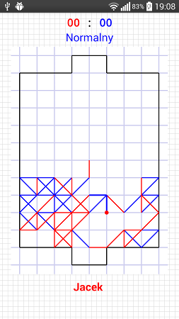
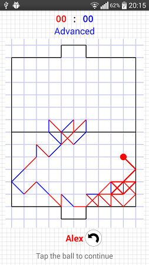

# Ya Paper Soccer

The game is available on [Google Play](https://play.google.com/store/apps/details?id=pl.derjack.papersoccer). The limited source code (single player, AI, benchmark) is available in this repository.

 

Long time ago (around android 2.3) project was made in Eclipse. Then several years later rewritten into Android Studio, fragment system, generally renewed for newer Android versions etc. It requires NDK to compile, as the movement calculations happen in C++. Some time ago I just decided to open the source code of AI. Of course at first it wasn't supposed to go public, so the code is unreadable for the 'outsiders' and will take some time to understand what's going on there.

Abstract of theory how the algorithm works is in this [file](ai_readme/paper_soccer.md) (in English) or this [file](ai_readme/pilkarzyki.md) (in Polish, more detailed).

As for Ya Paper Soccer in the store, I will be doing simple maintenance, bugfixes and updates for newer Android versions if it will be ever needed. Right now I'm just happy with what I got so far.

This project is licensed under MIT License.

## 17 April 2018
Project rewritten to new gradle system, works for Android Studio 3.1. Compiled for NDK 15c. It seems GCC produces 20% faster code than Clang.
